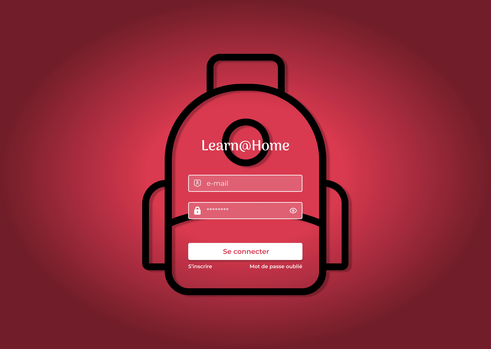

# P10_Learn_At_Home_OC

Projet n°10 de la formation [OpenClassrooms Front-End JS/React](https://openclassrooms.com/fr/paths/877-developpeur-dapplication-javascript-react).

## Contexte

-  Vous travaillez chez Dev4U, une petite agence web dans laquelle tout le monde a une double casquette !
   Votre entreprise a décroché un nouveau client : Learn@Home.
   Cette association met en relation des enfants en difficulté scolaire avec des tuteurs bénévoles.
   Fonctionnant surtout par le bouche à oreille et les SMS, elle souhaite désormais avoir un site web complet.

## Mission

- Définir les besoins client pour préparer la réunion de lancement
- Documents : cas d’usage, user stories, maquettes, kanban

## Use Cases

Voir le fichier `Tondeux_Pierre_1_diagramme_cas_usage_08112024.pdf` [Use Cases](livrables/Tondeux_Pierre_1_diagramme_cas_usage_08112024.pdf) du projet.

## User Stories

Voir le fichier `Tondeux_Pierre_2_user_stories_08112024.pdf` [User Stories](livrables/Tondeux_Pierre_2_user_stories_08112024.pdf) du projet.

## Maquette

Voir la maquette réalisée avec [Figma](https://www.figma.com/design/ZwSigWkx8lueDkLNK3hi5G/P10-Learn%40Home?m=auto&t=HkBVLiYE6bzr6fSy-1)

## Kanban

Voir la maquette réalisée avec [Trello](https://trello.com/invite/b/672dece6d43d4a143c35600a/ATTI35ba25441d507ef1d3f226e3ddca0803C2E626AA/learnhome)

